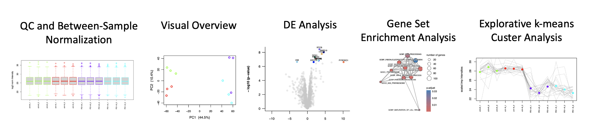

## General Information
Cassiopeia LFQ is an R script that uses knitr/LaTeX to automatically execute and report standard data analysis steps for label-free proteomics data, such as quality control, filtering and normalization, differential expression testing (using limma-trend), GSEA (for human and mouse proteomes), and other insightful & exploratory output (PCA, k-means clustering, etc.):

Cassiopeia LFQ developed to automatize the standard label-free quantification (LFQ) data analysis workflow in the Max Perutz Labs Mass Spectrometry Facility. The script’s input is a “proteinGroups.txt” file as produced by database searching using the proteomic software platform MaxQuant, as well as manually specified parameters that dictate what Cassiopeia is doing. To get an overview of all features, check out the "example.pdf" which showcases a standard Cassiopeia analysis output. For more information and instructions on how to use it, please refer to the user guide.

## Acknowledgements
- Markus Hartl 
- Weiqiang Chen 

## Change Log

### 4.6.7 2024-05-11 (by Moritz Madern)
1) Changed colors in heatmaps to a gradient of blue-yellow-red. Added additional heatmaps that show log2-transformed and centered intensities (i.e., row-mean=0)
2) Highlighting of proteins in volcano and MA plots is now achieved via text. Figure legends were consequently removed.
3) Added optional GSEA analysis for mouse and human using the limma DE-testing results as input. GSEA result tables will be stored in "GSEA folder" alongside "dotplots"". Due to space constraints, the pdf report only shows enrichment maps.

### 4.6.6 2023-03-10 (by Weiqiang Chen)
1) Cassiopeia_LFQ was changed to read "contaminants.fasta" instead of previous con_table.txt. 
2) con_table.txt was removed. A contaminants.fasta was included. User can now use their own contaminant database named "contaminants.fasta"

### 4.6.5 2022-10-19 (by Weiqiang Chen)
1) If batch is not NULL, a PCA plot after imputation and batch correction is now plotted to illustrate the effect of batch correction.

